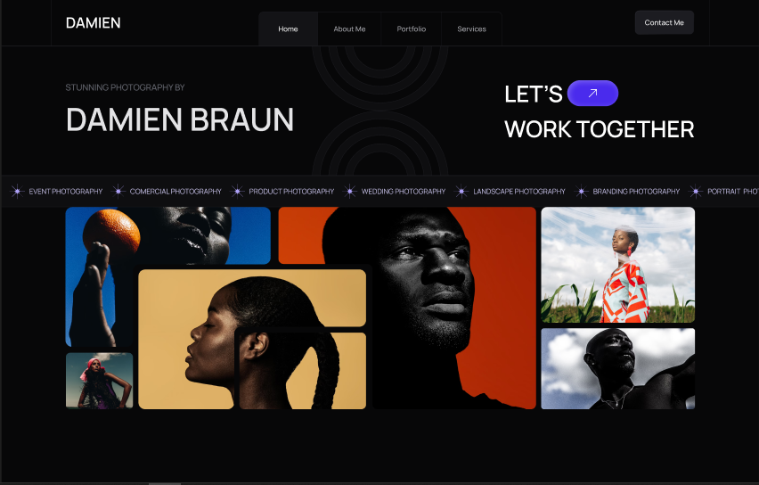

# Damien

>## Show in Figma [Click here](https://www.figma.com/design/DVUlD9ejYQfAVHTV5Olzbi/Photographer-Portfolio-Website-UI-Template---Dark-Theme-%7C-Produce-UI-(Community)?node-id=11-2&t=FC1QoKyFSNOSdsVq-1)

Damien is a sleek and modern photographer portfolio website, designed with a dark theme for a professional and elegant look. Built using HTML, CSS, and JavaScript, this project showcases a refined UI inspired by a Figma design. It's perfect for photographers looking to present their work in a visually stunning and user-friendly way.

## [Live Demo](https://ahmedmohamedag.github.io/Code-Challenges-50/damien/)

